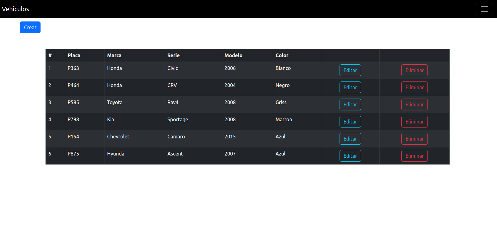
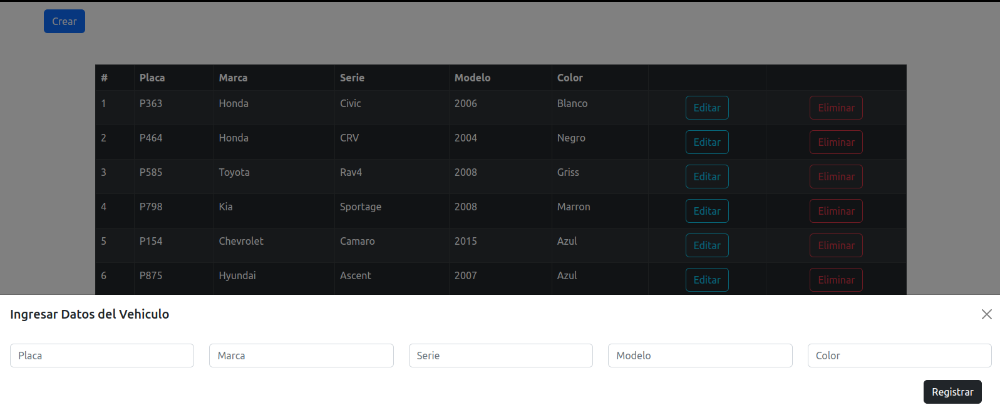
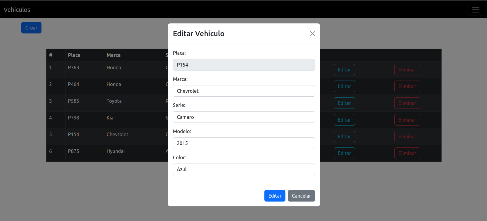
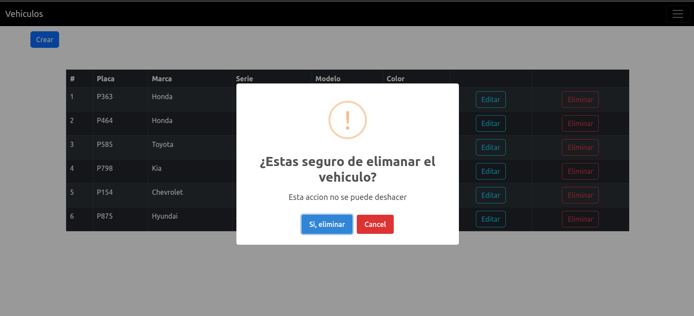
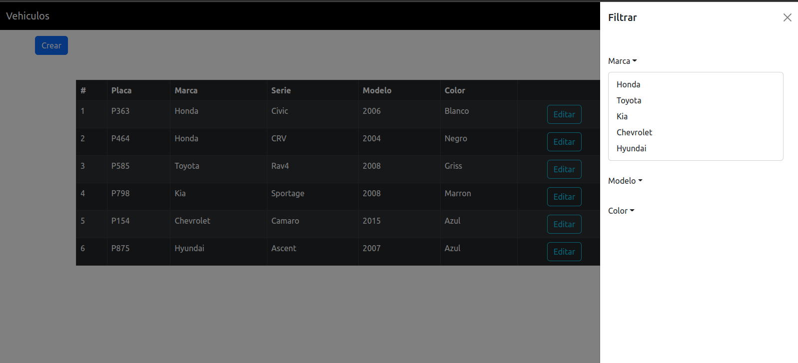
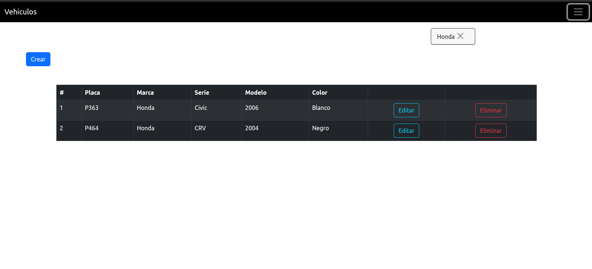
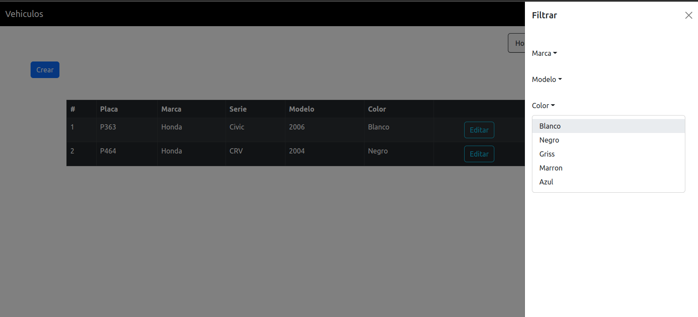
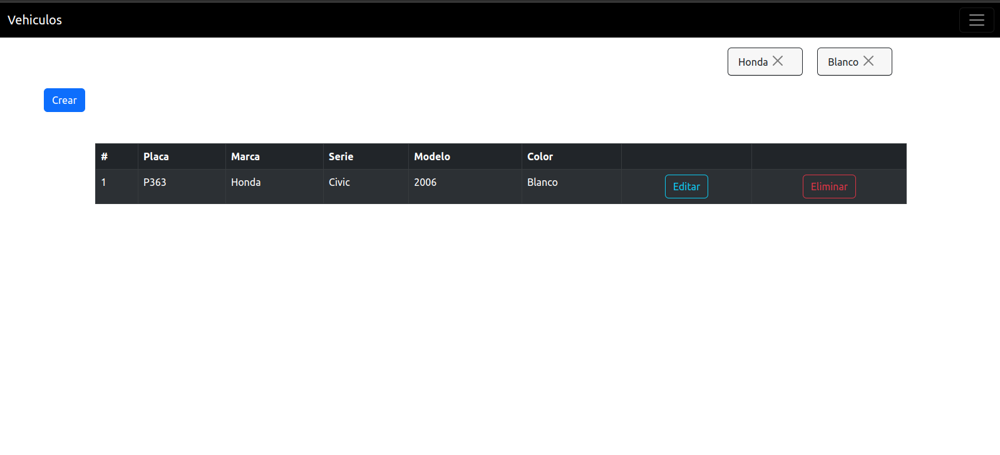

# Manual Tecnico

Esta aplicacion su interfaz grafica esta desarrollada con react utilizando redux toolkit, que nos permite manejar los estados entre los componentes de una mejor manera.

Entonces veamos cuales son los componentes que la conforman:

## CRUD 

### Visualizacion de todos los vehiculos

Esta pantalla principal nos muestra todos los vehiculos almacenados en la base de datos con todos sus detalles.

### Creacion de vehiculo

Este componente nos permite crear un nuevo vehiculo en la base de datos, se accede con el boton de color azul que se ubica en la parte superior izquierda de la pantalla principal

### Edicion de vehiculo

Para cada automivil tenemos la opcion de actualizar todos sus atributos a excepcion de la placa ya que esta es verificada cuando se inserta el vehiculo

### ELiminar vehiculo

En cada vehiculo tenemos la opcion de poder eliminarlo pero cada uno cuenta con una advertencia de que dicha accion no se puede revertir

## Filtrar

Se cuenta con una funcion de filtrado de datos, mediante a los atributos <b>marca, modelo, color</b>

### Filtrado por marca

En la parte superior derecha se cuenta con un componente donde se encuentran todos los atributos existentes de los vehiculos almacenados

Seleccionado el dato nos aparece una etiqueta para que se tenga la informacion que solo estan mostrandos los vehciulos por el dato seleccionado

### Agregar otro filtro

Ya con los datos filtrados podemos seguir filtrando para reducir nuestra busqueda al vehiculo deseado

Se selecciona el color y se muestra el resultado 

